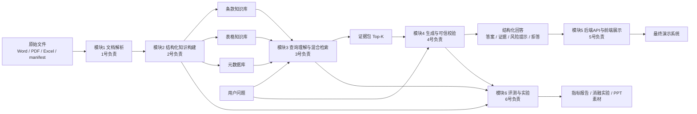
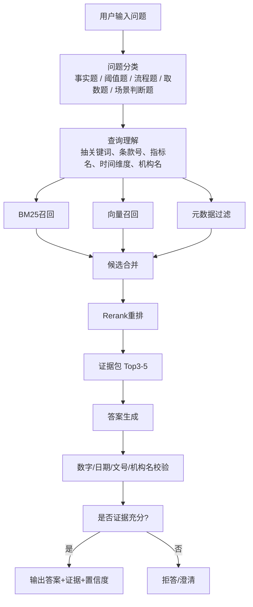
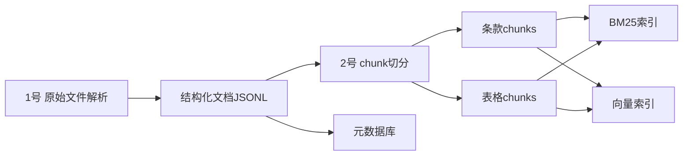
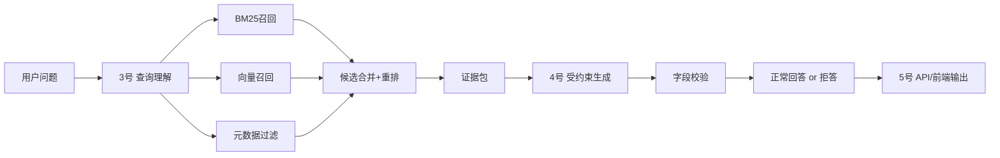
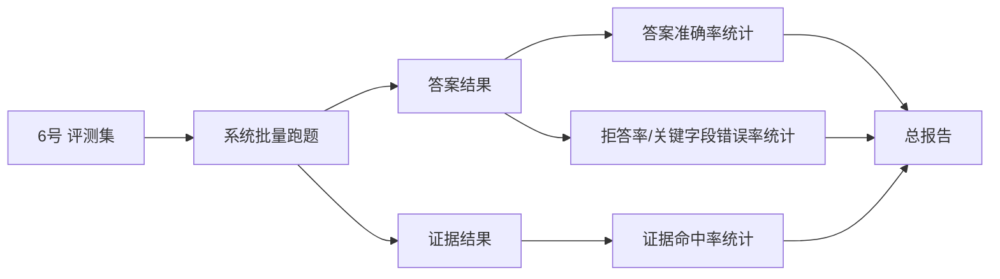

# 03赛题六人分工与模块衔接图

这份文档解决两个问题：

1. 六个人到底各做什么
2. 整个系统的模块是怎么连起来的

目标是让你们能直接按这份文档开工，而不是继续停留在“有个方案”。

## 1. 六人团队的最优分工

这道题最怕两种情况：

1. 所有人都在碰模型，没人把解析和检索做稳
2. 每个人都写了一部分，但最后合不成一个完整系统

所以六个人最合理的分法不是按“算法/前端/后端”粗分，而是按最终作品链路来分。

建议六个角色如下：

1. 数据解析负责人
2. 知识库与索引负责人
3. 查询理解与检索负责人
4. 生成与可信控制负责人
5. 后端集成与前端展示负责人
6. 评测、实验与答辩负责人

## 2. 六人分工总览

| 角色 | 负责人模块 | 核心任务 | 直接交付 |
|---|---|---|---|
| 1号 | 文档解析 | 解析 Word/PDF/Excel，抽结构和元数据 | `parsed_docs.jsonl`、`parsed_tables.jsonl` |
| 2号 | 知识库构建 | chunk 切分、元数据挂载、BM25/向量索引 | `clause_chunks.jsonl`、`table_chunks.jsonl`、`faiss_index` |
| 3号 | 查询理解+检索 | 问题分类、关键词抽取、混合检索、重排 | `query_parser.py`、`hybrid_retriever.py` |
| 4号 | 生成+可信校验 | 证据约束生成、数字校验、拒答机制 | `answer_generator.py`、`verifier.py` |
| 5号 | 系统集成+前端 | FastAPI、前端、证据展示、联调 | `main.py`、前端页面 |
| 6号 | 评测+报告 | 构造评测集、跑消融、写报告和 PPT | `run_eval.py`、评测报告、答辩材料 |

## 3. 整体系统衔接图

先看全局，知道每个人负责的模块在系统里处于哪一段。

这张图对应的意思很简单：

1. 1号和2号负责“离线知识底座”
2. 3号和4号负责“在线问答核心”
3. 5号负责把它们拼成“可演示系统”
4. 6号负责把它们变成“可证明有效的比赛作品”

## 4. 端到端流水线图

这张图看的是一次问答从输入到输出怎么走。

这条流水线里每个模块的意义：

1. 不是一上来就让模型回答
2. 先决定问题属于哪类
3. 再决定怎么检索
4. 再把证据找准
5. 最后才生成
6. 生成完还要校验

这正是“可信 RAG”和普通聊天机器人的区别。

## 5. 六个人分别要干什么

下面把六个人拆细到“负责模块、上下游依赖、每天产出”。

## 5.1 1号：数据解析负责人

### 负责模块

1. 原始文件管理
2. Word/PDF 解析
3. Excel 解析
4. 统一文档结构输出

### 他的上游

没有上游，他最先开工。

### 他的下游

2号知识库构建直接依赖他的输出。

### 他的核心任务

1. 读取 manifest
2. 给每个文件分配或清洗 `doc_id`
3. 提取制度文档标题、文号、发布日期、发文机关、来源 URL
4. 提取条款层级结构
5. 提取 Excel 的 sheet、表头、指标名、单位、期间、单元格值
6. 输出统一 JSONL

### 他要产出的文件

1. `data/parsed/parsed_docs.jsonl`
2. `data/parsed/parsed_tables.jsonl`
3. `data/parsed/doc_meta.jsonl`

### 他交付的数据格式

制度文档至少包含：

1. `doc_id`
2. `title`
3. `publish_date`
4. `issuer`
5. `source_url`
6. `section_path`
7. `clause_no`
8. `text`

表格文档至少包含：

1. `doc_id`
2. `sheet_name`
3. `table_name`
4. `metric_name`
5. `period`
6. `unit`
7. `value`
8. `row_header`
9. `col_header`

### 他什么时候算完成

当 2号能直接拿他的结果去建知识库，不需要再手动补字段时，他就完成了。

## 5.2 2号：知识库与索引负责人

### 负责模块

1. 条款 chunk 切分
2. 表格 chunk 切分
3. 元数据挂载
4. BM25 索引
5. 向量索引

### 他的上游

1号解析结果。

### 他的下游

3号检索模块直接依赖他的知识库。

### 他的核心任务

1. 设计统一 chunk schema
2. 把制度文档切成条款级 chunk
3. 把 Excel 切成表格区域级或单元格组级 chunk
4. 生成可用于 BM25 的检索文本
5. 生成 embedding
6. 建 FAISS 索引
7. 建元数据映射表

### 他要产出的文件

1. `data/processed/clause_chunks.jsonl`
2. `data/processed/table_chunks.jsonl`
3. `indexes/faiss/*`
4. `indexes/bm25_corpus.jsonl`
5. `data/processed/metadata.db`

### 他必须保证的事情

1. 每个 chunk 都能回溯原文
2. 条款和表格可以分开检索
3. 支持按标题、机构、日期、主题过滤

### 他什么时候算完成

当 3号能基于这些索引做稳定召回时，他就完成了。

## 5.3 3号：查询理解与检索负责人

### 负责模块

1. 问题分类
2. 查询关键词抽取
3. 混合检索
4. 候选合并
5. rerank 重排

### 他的上游

2号的知识库和索引。

### 他的下游

4号生成模块依赖他的证据包。

### 他的核心任务

1. 把问题分成五类
2. 从问题中抽取：
   - 关键词
   - 条款号
   - 指标名
   - 机构名
   - 时间维度
3. 同时跑：
   - BM25
   - 向量检索
   - 元数据过滤
4. 合并结果并去重
5. rerank 后输出 Top3-5 证据

### 他要产出的文件

1. `app/retrieval/query_parser.py`
2. `app/retrieval/retriever_bm25.py`
3. `app/retrieval/retriever_vector.py`
4. `app/retrieval/hybrid_retriever.py`
5. `app/retrieval/reranker.py`

### 他对系统最关键的价值

他决定“系统找得到找不到”。  
这题很多队伍最后不是输在生成，而是输在证据没找准。

### 他什么时候算完成

当 Top-3 证据命中率足够高，4号能拿着证据稳定回答时，他就完成了。

## 5.4 4号：生成与可信控制负责人

### 负责模块

1. 证据约束生成
2. 数字校验
3. 规范表达校验
4. 拒答机制
5. 结构化回答输出

### 他的上游

3号返回的证据包。

### 他的下游

5号前端展示和 API 输出依赖他的结构化结果。

### 他的核心任务

1. 设计答案输出格式
2. 写 evidence-aware prompt
3. 强制答案引用证据
4. 抽取并校验：
   - 金额
   - 比例
   - 日期
   - 文号
   - 机构名
   - “应当/不得/可以/原则上”
5. 当证据不足时触发拒答或澄清

### 他要产出的文件

1. `app/generation/prompt_builder.py`
2. `app/generation/answer_generator.py`
3. `app/generation/verifier.py`
4. `app/generation/refusal.py`
5. `app/schemas/answer_schema.py`

### 他对系统最关键的价值

他决定“系统是不是可信”。  
同样一句答案，有没有证据绑定、有没有字段校验、能不能拒答，决定了作品能不能像获奖作品。

### 他什么时候算完成

当系统能稳定输出：

1. 结论
2. 依据
3. 证据来源
4. 风险提示
5. 拒答结果

他就完成了。

## 5.5 5号：后端集成与前端展示负责人

### 负责模块

1. FastAPI 服务
2. 路由封装
3. 前端问答页面
4. 证据展示页面
5. 全链路联调

### 他的上游

3号和4号的在线能力。

### 他的下游

最终评委演示界面，直接面向外部。

### 他的核心任务

1. 定义 API 输入输出协议
2. 把检索和生成串成 `/ask` 接口
3. 做前端输入框、答案区、证据区、原文预览区
4. 处理接口异常
5. 做最终演示流程优化

### 他要产出的文件

1. `app/api/main.py`
2. `app/api/routes.py`
3. `frontend/` 或 `streamlit_app.py`
4. `config/`

### 他必须保证的事情

1. 页面能稳定跑
2. 一问一答能在可接受时延内完成
3. 证据能展示
4. 拒答也能展示

### 他什么时候算完成

当评委能打开页面直接看到完整问答流程时，他就完成了。

## 5.6 6号：评测、实验与答辩负责人

### 负责模块

1. 评测集整理
2. 指标计算
3. 消融实验
4. 错例分析
5. 技术报告
6. 答辩 PPT

### 他的上游

1号到5号的最终系统能力。

### 他的下游

最终提交材料和答辩表现。

### 他的核心任务

1. 用 42 条种子样本扩充内部评测集
2. 定义五类问题的评测规则
3. 跑四组实验：
   - BM25 only
   - vector only
   - hybrid retrieval
   - full pipeline
4. 统计：
   - 准确率
   - 证据命中率
   - 拒答率
   - 关键字段错误率
   - 平均响应时延
5. 写错因分析
6. 组织答辩叙事

### 他要产出的文件

1. `eval/run_eval.py`
2. `eval/metrics.py`
3. `reports/retrieval_report.md`
4. `reports/final_report.md`
5. `slides/答辩提纲.md`

### 他什么时候算完成

当你们不仅“能演示”，还能“拿数据证明有效”时，他就完成了。

## 6. 模块之间怎么衔接

这一部分最重要。因为团队做挂掉，通常不是某个人不会做，而是模块之间没对上。

## 6.1 离线链路：知识底座构建

含义：

1. 1号先把原始文件变成结构化中间结果
2. 2号基于这些中间结果做 chunk 和索引
3. 这条链路完成后，系统才有“可检索知识底座”

## 6.2 在线链路：问答服务

含义：

1. 3号负责把问题找准证据
2. 4号负责基于证据回答并校验
3. 5号负责把结果展示出来

## 6.3 评测链路：比赛成绩证明

含义：

1. 6号不是最后才开始
2. 6号应该尽早设计评测标准
3. 否则你们做完也不知道哪里强、哪里弱

## 7. 一次完整联调是怎么发生的

把一次完整联调写清楚，大家就知道什么时候该找谁。

### 第一次联调：1号和2号

目标：
确认解析结果足够支持建库。

检查点：

1. `doc_id` 是否唯一
2. 条款编号是否保留
3. 表头结构是否保留
4. 时间维度是否保留

### 第二次联调：2号和3号

目标：
确认知识库能被稳定检索。

检查点：

1. 条款题能否召回正确条款
2. 表格题能否召回正确表格区域
3. 是否支持标题/时间过滤

### 第三次联调：3号和4号

目标：
确认检索出的证据足够支持生成。

检查点：

1. 证据是否过长
2. 证据是否冲突
3. 证据是否足够回答
4. 不足时能否拒答

### 第四次联调：4号和5号

目标：
确认结构化回答能稳定展示。

检查点：

1. 答案字段是否统一
2. 证据字段是否统一
3. 拒答字段是否统一
4. 页面是否能展示原文定位

### 第五次联调：5号和6号

目标：
确认系统能批量评测与演示。

检查点：

1. API 是否可批量调用
2. 输出是否可自动评分
3. 指标是否可落报表

## 8. 六人并行开工顺序

下面这个顺序最省时间。

## 第 1 批并行

1号开工：
原始文档解析。

5号开工：
先搭 API 壳子和前端壳子。

6号开工：
整理评测集模板和报告模板。

理由：
这三个人一开始互不阻塞。

## 第 2 批并行

2号接 1号输出：
开始做 chunk 和索引。

3号同步开工：
先写查询理解规则和检索框架。

理由：
2号和3号可以边等边搭骨架。

## 第 3 批并行

4号开工：
定义回答 schema、生成模板、校验逻辑。

理由：
4号不必等最终检索完全稳定，先把回答格式定死很重要。

## 第 4 批统一收口

1. 3号输出稳定证据包
2. 4号接证据包生成答案
3. 5号把前后端串起来
4. 6号跑评测和消融

## 9. 最终对外呈现时，六个人的成果如何合并

最后不是六份成果，而是一个统一作品。

对外只呈现三层：

1. **前台**
   一个可信问答页面。

2. **后台**
   一个可运行问答 API。

3. **证明材料**
   一组实验指标、消融结果、错误分析和 PPT。

其背后对应的是：

1. 1号和2号做“底座”
2. 3号和4号做“核心能力”
3. 5号做“产品化呈现”
4. 6号做“比赛说服力”

## 10. 最推荐的六人会议沟通方式

建议你们以后内部开会，不要按“谁今天干了什么”汇报，而按这四个问题汇报：

1. 我的输入来自谁
2. 我的输出给谁
3. 我现在卡在哪个字段/接口/指标上
4. 我什么时候能交给下游

例如：

1号说：
我今天把 Excel 的多级表头抽出来了，明天能给 2号稳定 schema。

2号说：
我现在能建条款库，但表格 chunk 还缺 `period` 字段，等 1号补。

3号说：
我检索条款题没问题，但表格题命中率还不够，正在调 metadata filter。

这样沟通效率会高很多。

## 11. 最后的直接结论

六个人最优分工可以记成一句话：

1. **1号做原始数据变结构**
2. **2号做结构数据变知识库**
3. **3号做知识库变证据**
4. **4号做证据变可信答案**
5. **5号做答案变可演示系统**
6. **6号做系统变可获奖作品**

如果你想继续往下走，我下一步可以直接帮你做两件很具体的东西：

1. 把这六人分工再细成“10天冲刺排班表”
2. 直接给你们生成项目目录结构和每个模块的代码空壳
